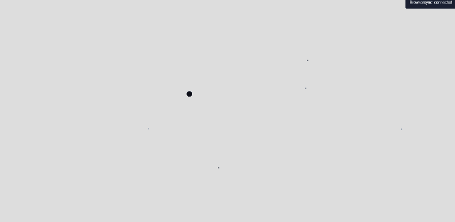

# Gravity Simulation
Visual implementation of gravity force attraction using the library [p5.js](https://p5js.org/)

## Description
The implementation is basically centered in 2 classes: `BlackHole` and `Particle`:
- **BlackHole**: An object that attracts particles depending on its mass
- **Particle**: An object that is attracted by BlackHoles

> **NOTE:** Particles do not attract each other. They are only attracted by BlackHoles

The sizes of each `Particle` and `BlackHole` are proportional to its mass.

## Demonstration
|Trailing
|-|
||

|No Trailing|
|-|
||

|Multiple Black Holes|
|-|
|||

## Getting Started
## Requirements
Make sure you have properly installed:
- [Git](https://git-scm.com/)
- [Node JS](https://nodejs.org/en/)
- [npm](https://www.npmjs.com/get-npm)

## How to Execute
- First, clone this repository:
```
git clone https://gitlab.com/alyson1907/gravity-simulation.git
```

- Now, change the directory into the created folder ( `cd <folder_name>` ) and do the following:
  - Install de repository dependencies:
  ```
  npm install
  ```

  - Run the local server:
  ```
  npm start
  ```

The command should start a local server **AND** open it in your default browser. You can also manually access the running server by entering `http://localhost:3000/` in the address bar of your browser.
